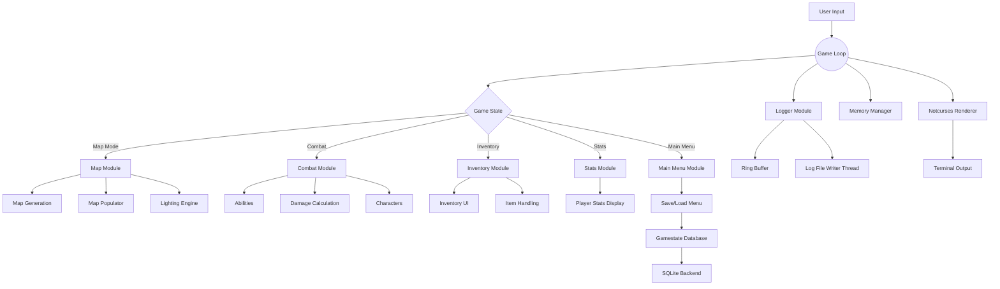
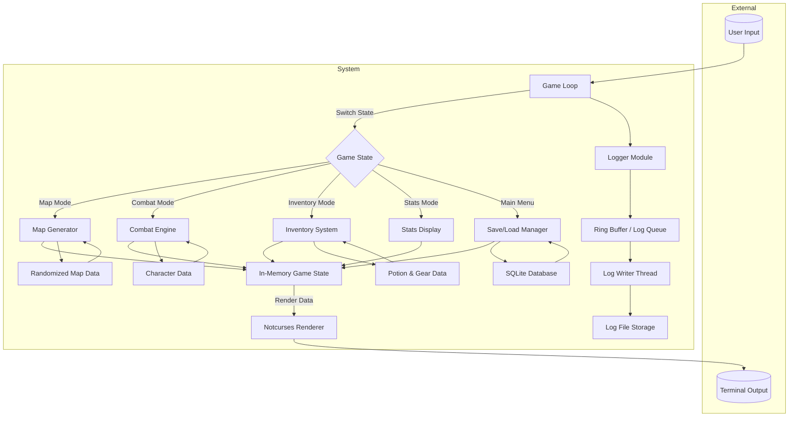
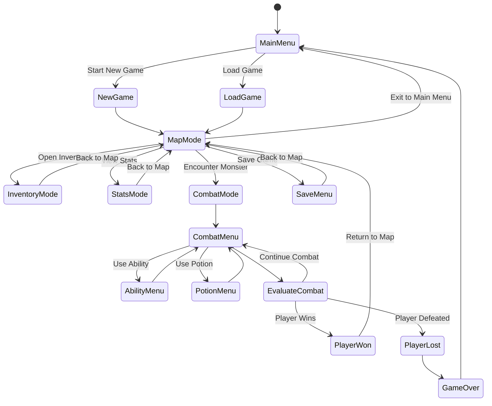
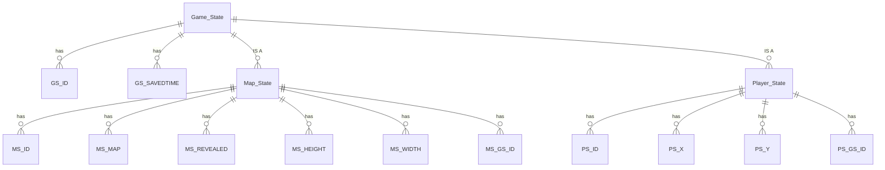
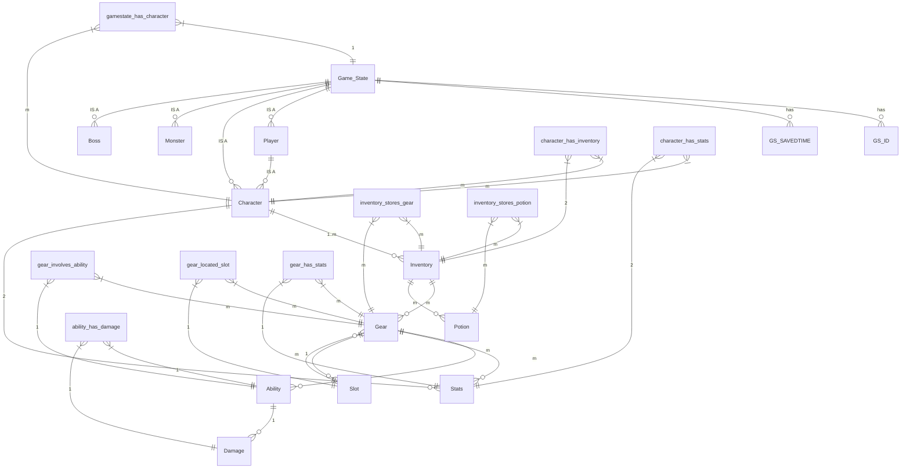
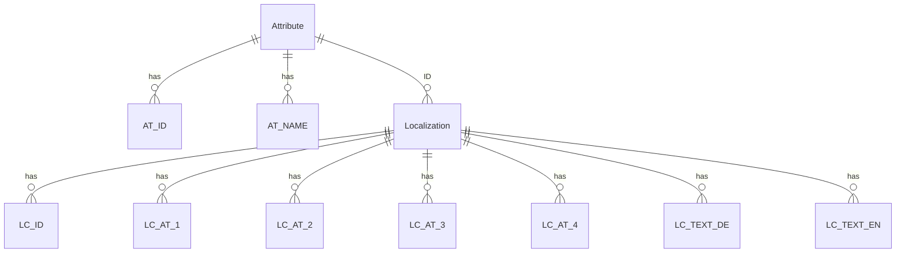

# DungeonCrawl

## Repo statistics
The number of lines of source code written.
```
-------------------------------------------------------------------------------
Language                     files          blank        comment           code
-------------------------------------------------------------------------------
C                               51           1019           1134           4922
C/C++ Header                    46            281            403           1149
Meson                            1             38             17            122
-------------------------------------------------------------------------------
SUM:                            98           1338           1554           6193
-------------------------------------------------------------------------------
```

we will use then C2X standard with Meson as our build tool and for unit testing

indentation will be 4 spaces
regular C naming conventions


# Scrum people
Jil & Nino

# Manual 
Lucien

# Definition of Done
- code runs and does what it is supposed to do
- code is reviewed
- has positive and negative unit tests
- test coverage of at least 90%
- can build on all platforms
- fulfills clean code standards
- code is documented

# TestCoverage
The testcoverage can be checked <a href="https://raw.githack.com/PM4-FS25-DungeonCrawl/DungeonCrawl/refs/heads/develop/documents/coverage/coverage-report.html" target="_blank">here</a>.

# Project Documentation

## Architecture Diagram
This architecture diagram gives an overview of the different modules that our codebase consists of.

## Data Flow Diagram
This diagram shows the general flow of data within our application.

## State Diagram
High level overview of the game flow. The game flow is mostly implemented via multiple nested 

# Entity Relation Diagrams
## Gamestate Diagram

## Items and Abilities Diagram

## Localization Diagram

