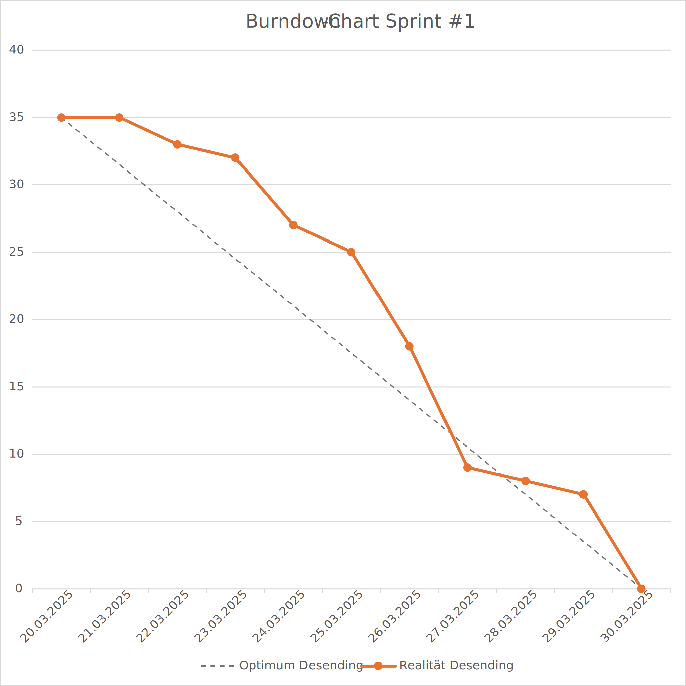
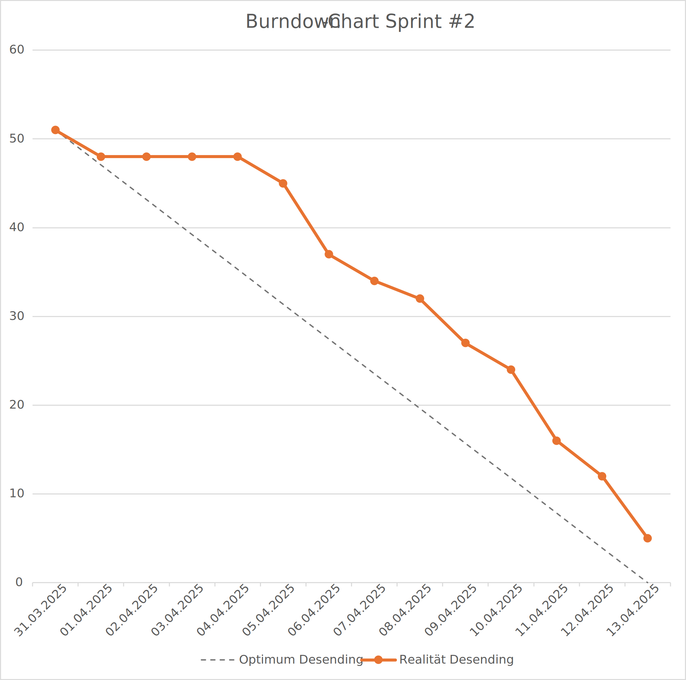
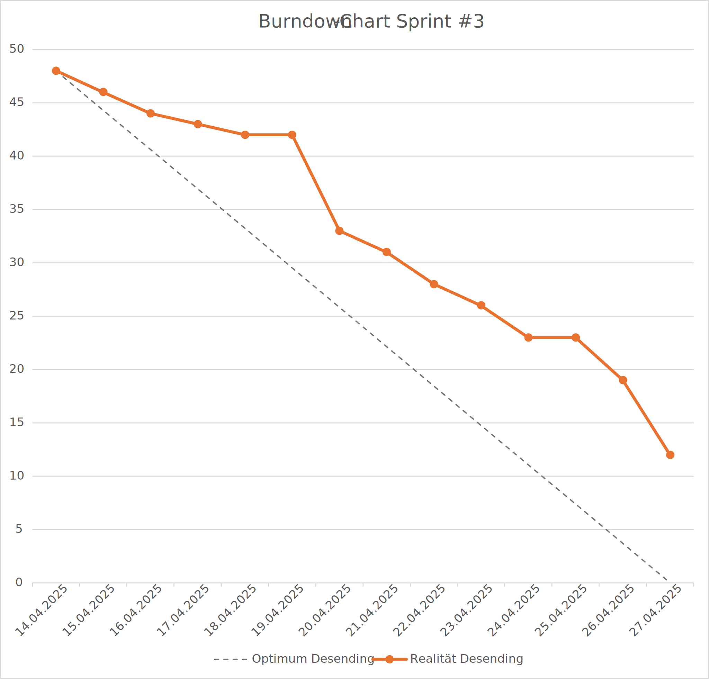
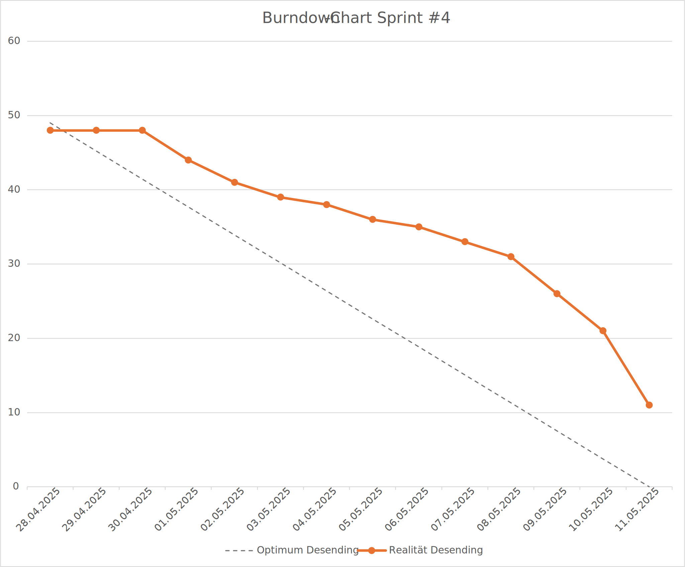
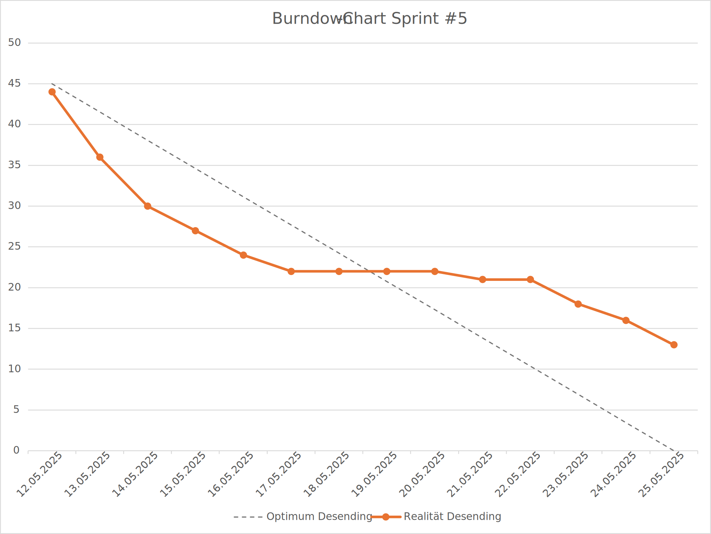
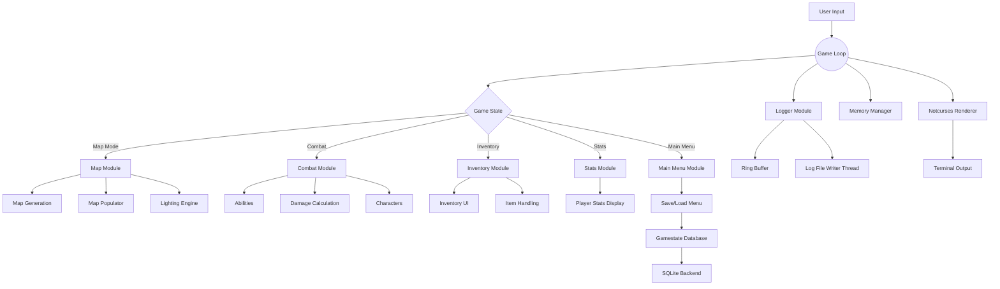
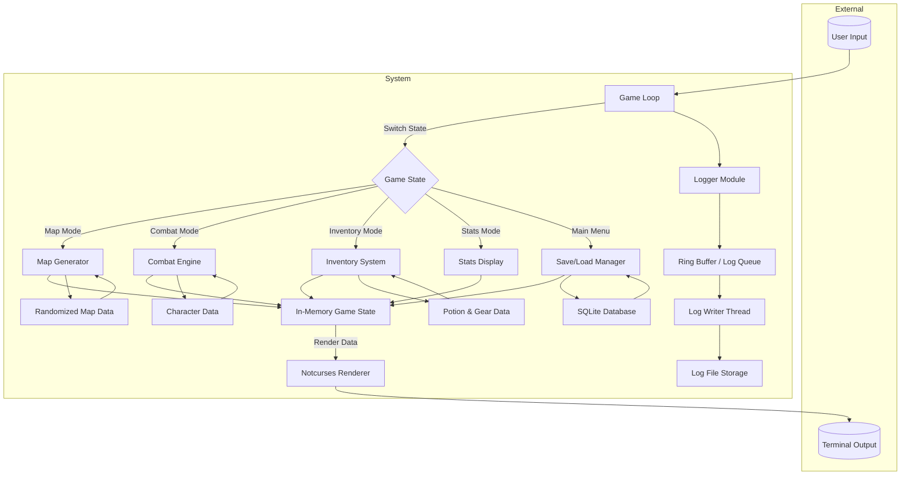
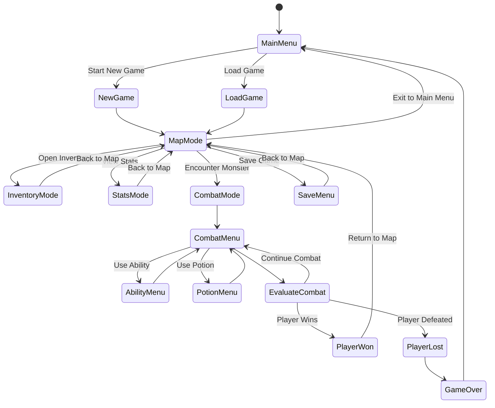
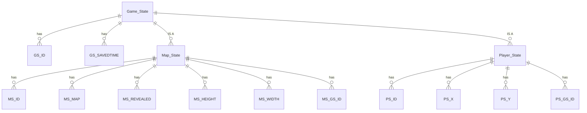
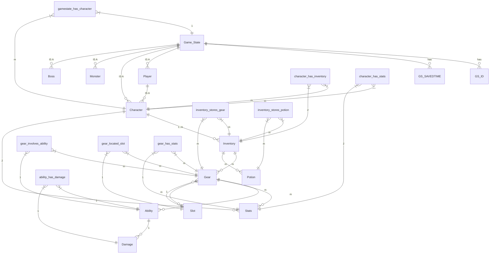

# 🟥 DungeonCrawl 🟥

Welcome to the Readme for the hit game DungeonCrawl inspired by the 80's classic "Rogue"!

## 🔴 Supported Platforms 🔴
Because Microsoft is a very small company with very few resources, the windows terminal is not state of the art and cannot handle images being displayed in correctly unless it is running WSL.
The game Runs on Linux and Macos.

On macos run brew install notcurses

On linux run sudo apt install libnotcurses-dev libnotcurses3

Simply download the binary from the releases and run it. You may have to grant permisions from the operating system.

## 🔴 Manual 🔴
If you are unsure how to play the game, check out the manual [here](Manual.pdf)

## 🔴 API Documentation 🔴

A full API reference generated from the code comments with doxygen can be found [here](https://pm4-fs25-dungeoncrawl.github.io/DungeonCrawl/)

##  🔴 Repo statistics 🔴 
The number of lines of source code written.
```
-------------------------------------------------------------------------------
Language                     files          blank        comment           code
-------------------------------------------------------------------------------
C                               70           1791           1775           8546
C/C++ Header                    65            535           2220           1479
Text                             1            112              0            454
Meson                            1             46              6            179
Markdown                         1             10              0             27
-------------------------------------------------------------------------------
SUM:                           138           2494           4001          10685
-------------------------------------------------------------------------------
```

we will use then C2X standard with Meson as our build tool and for unit testing

indentation will be 4 spaces

regular C naming conventions

# 🟧 Decision Record 🟧
## 🟠 Why write the game in C? 🟠
We decided to use C because not being able to rely on objects and built-in features of modern programming languages was an interesting challenge.

Having to use pointers and structs instead of objects led to a lot of challenges, but it was an interesting learning opportunity nonetheless. That being said, in the future we would rather use a modern object-oriented language like Go for a project like this. 

## 🟠 Why use SQL for saving gamestates? 🟠
Primarily just because we wanted to use SQL, but also because saving the gamestate in a .txt or something similar would make it very easy for the player to manipulate their game.

Using SQL was definitely more time-consuming and required more effort than a simpler solution, but we think it was worth it.

## 🟠 Why use property files for localization? 🟠
Initially, we used SQL for localization as well but later decided to switch to property files for a number of reasons:
- Localization took way too long to load.
- It was difficult to quickly add new text.
Property files provided a much simpler solution that was both faster to expand and easier to integrate into our program.

## 🟠 Why use notcurses? 🟠
Because notcurses is one of the best and most-used terminal I/O libraries for C. We started with the library termbox but later switched to notcurses because termbox has no Windows support and is very limited in functionality.

# 🟨 Definition of Done 🟨
- code runs and does what it is supposed to do
- code is reviewed
- has positive and negative unit tests
- test coverage of at least 80% for the modules where it makes sense
- can build on all platforms
- fulfills clean code standards
- code is documented

# 🟩 TestCoverage 🟩
The test coverage can be checked <a href="https://raw.githack.com/PM4-FS25-DungeonCrawl/DungeonCrawl/refs/heads/develop/documents/coverage/coverage-report.html" target="_blank">here</a>.

## 🟦 Testing Scope 🟦

### 🔵 Character: 🔵 
- character.c

### 🔵  Combat: 🔵 
- combat_mode.c
    - invoke_potion_effect()
    - consume_ability_resource()
    - get_random_ability()
- damage.c

### 🔵  Database: 🔵 
- database.c

### 🔵 Map: 🔵 
- map_generator.c
- map_mode.c
- draw_light.c

### 🔵 Stats: 🔵 
- stats.c

### 🔵 Memory: 🔵 
- memory_management.c

### 🔵 Logging: 🔵 
- ringbuffer.c

## 🔵 Decisions Made in Testing 🔵 

### 🔵 UI components 🔵 
- **Description**: UI components with the sole purpose of displaying text for the player are playtested and don't have automated tests.
- **Reasoning**: Testing the UI through automation would only work if the components are fixed and won't change by using a framework or tool. Our UI components are subject to change so we deemed the effort not worthwhile at this stage.
- **Impact**: Visual bugs might appear in release version if they weren't found during playtesting.

# Development Progress






# 🟪 Project Documentation 🟪

## 🟣 Architecture Diagram 🟣
This architecture diagram gives an overview of the different modules that our codebase consists of.

## 🟣 Data Flow Diagram 🟣
This diagram shows the general flow of data within our application.

## 🟣 State Diagram 🟣
High level overview of the game flow. The game flow is mostly implemented via multiple nested 

## 🟣 Gamestate Diagram 🟣

## 🟣 Items and Abilities Diagram 🟣

